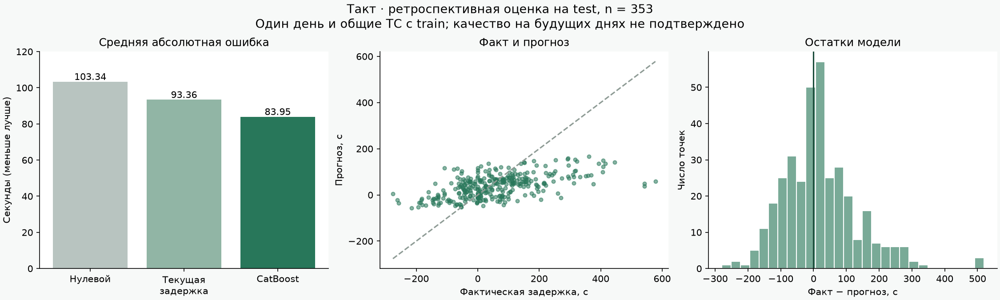

# Анализ решения и зарубежных аналогов

Этот файл хранится в integration-ветке как зафиксированный аналитический
снимок полного прототипа. Исходники backend/ML/dashboard, датасет и артефакты
модели в этой ветке не дублируются; пути к ним относятся к полному checkout.

Дата исследования: 25 сентября 2026. Рассматриваются официальные описания продуктов; маркетинговые обещания не являются сравнительным бенчмарком на нашем датасете.

## Готовые зарубежные решения

| Решение | Что уже решает | Применимость к задаче |
|---|---|---|
| [Swiftly](https://www.goswift.ly/) | Прогнозы прибытия, работа с транспортными данными, историческая аналитика. | Ближайший коммерческий класс решения для операторов. Понадобится интеграция телеметрии; совместимость с данным NDTP из источника не подтверждена. |
| [Optibus Predictive Runtimes](https://blog.optibus.com/introducing-optibus-performance-suite-helping-to-analyze-and-improve-on-time-performance?hs_amp=true) | Прогноз времени прохождения маршрутов, анализ пунктуальности и улучшение расписаний. | Сильный ориентир для планирования. Совпадение с точной целью «задержка на первой остановке в (T+10,T+15]» не установлено. |
| [Transit Prediction Engine](https://resources.transitapp.com/article/462-trip-updates) | ML-прогноз прибытия из положения транспорта; особое внимание автобусным сетям. | Пример использования динамики движения для ETA. Пассажирский продукт не заменяет диспетчерский интерфейс и NDTP-приёмник. |
| [OneBusAway](https://developer.onebusaway.org/) | Открытая инфраструктура информации о транспорте, backend для GTFS/GTFS-realtime и клиентских приложений. | Наиболее полезная открытая основа для дальнейшей совместимости. Потребуется свой адаптер NDTP и модель риска. |

Вывод: класс задачи уже решён в зарубежных продуктах; заявлять новизну самого прогноза задержек нельзя. Практическая ценность MVP — соответствие конкретному формату данных, прозрачная проверка горизонта, воспроизводимая модель и локальный запуск. Покупка платформы для этого прототипа не нужна. Сравнить качество с поставщиками без их прогнозов на одинаковой выборке невозможно; публичные цены и условия внедрения не исследовались.

Методические ориентиры: [BusTr, Google](https://arxiv.org/abs/2007.00882) использует дорожную информацию для прогноза времени движения автобусов. [BusTime](https://arxiv.org/abs/2003.10373) обсуждает практическую оценку нескольких классов моделей прогноза прибытия. В раздаче нет дорожного трафика и погоды, поэтому такие признаки не имитируются.

## Аудит датасета

- Train: 287 849 строк телеметрии, 4 434 размеченные точки; 1 141 точка относится к 13 реальным ТС. Остальные ТС с ID от 9 000 000 синтетические и исключены из обучения этой версии.
- Test: 105 945 строк телеметрии, 353 размеченные точки, 13 ТС.
- Validate: 151 точка, 11 ТС. Меток для них в коде нет; сформирован submission без восстановления скрытых ответов из других файлов.
- Идентификаторы прогнозных точек и целевых остановок между тремя наборами не пересекаются. ТС и день пересекаются.
- У нескольких остановок совпадают плановые времена. При прогнозе разрешается заданный target_stop_id среди остановок с минимальным временем в окне; выбор первой строки без учёта равенства времён ошибочно отклонял бы 5 validate-точек.
- `test/traffic.csv` и `validate/traffic.csv` побайтно идентичны. SHA256: `3c74bb9d3cc5e076a2e7f89de7e78fb103c350757d16c9d629de651ee09bf517`.
- `schedule.csv` содержит фактические прибытия. Загрузчик читает только явный разрешённый список плановых колонок: фактические времена не используются ни для признаков, ни для восстановления validate.
- По Unix-суффиксам `sample_id` наивные времена CSV соответствуют UTC. NDTP Unix seconds также трактуются как UTC. Интерфейс отображает Europe/Moscow.
- Нет официальных номеров маршрутов, дорожной геометрии, статуса дверей и размеченных причин задержек. Соединённые плановые остановки — схема, а причины — гипотезы.

## Статистическая постановка

Для точки T выбирается первая плановая остановка с `600 < target_time - T <= 900` секунд. Цель `y = actual_arrival - scheduled_arrival`, в секундах. Отрицательный прогноз означает опережение. Это окно **планового прибытия**, а не доказанная гарантия предупреждения за 10 минут до фактического начала инцидента.

Главная функция потерь: `MAE = mean(abs(y - prediction))`. Оптимальный точечный прогноз для MAE — условная медиана. Поэтому CatBoost обучается с MAE, а линейный PyTorch-кандидат — с L1 loss.

V5.1 использует 102 общих офлайн/онлайн признака: текущее отклонение, горизонт, циклическое время, телеметрические окна 1/3/5/10 минут, динамику скорости и положения, геометрию плановых остановок и оценку оставшегося пути. История ограничена моментом T; будущие строки отсекаются. `tr_id` и `target_stop_id` исключены, чтобы модель не запоминала конкретные ТС и остановки.

Сравниваемые модели:

1. Перенос `cur_dev_s` без изменения.
2. CatBoost V5.1: глубина 6, число итераций выбирается early stopping на tuning-блоке.
3. Линейная модель PyTorch, стандартизированные признаки, L1 и слабая L2-регуляризация.

Только реальные train-точки сортируются по времени. Границы — 65% и 83% временного распределения, а доступность метки учитывает фактическое прибытие. Early stopping выполняется на 198 tuning-точках. Финальный CatBoost обучается на 937 доступных development-точках; последние 194 точки используются только для калибровки. Test не участвует в обучении, выборе итераций или калибровке.

Важно: официальный test перемешан по времени с train. Это ретроспективный бенчмарк по правилам раздачи, а не полноценная проверка на будущем дне. Даже при причинных признаках модель и калибровка обучены на части того же дня. Поэтому данный replay демонстрирует поток обработки, но не доказывает честный исторический онлайн-backtest обученной заранее системы.

## Неопределённость и риск

На калибровке вычисляются остатки `r = y - prediction`. Радиус 90%-го split-conformal интервала — порядковая статистика `ceil((n+1)*0.9)` массива `abs(r)`. Интервал: `[prediction-q, prediction+q]`. Временная зависимость нарушает предпосылку обменности: номинальные 90% не гарантируются на будущих днях.

Риск задержки более 120 секунд: `(1 + count(r > 120 - prediction)) / (n + 2)`. ML API возвращает его вместе с прогнозом и интервалом; Backend больше не заменяет результат произвольной логистической формулой. Это эмпирическая калибровка, не отдельный классификатор. Пороги интерфейса: менее 35% — зелёный, 35–70% — жёлтый, от 70% — красный.

Операционная картина различает `current_deviation_s` и `prediction_s`:
первое — оценка текущего положения на плановом сегменте, второе — ожидаемое
отклонение на целевой остановке. Backend сохраняет ответ V5, интервал и риск
без эвристического сдвига относительно текущей оценки. Ранее использовавшийся
`stabilize_forecast` удалён: он не учитывал расстояние, скорость и оставшийся
путь, а после изменения прогноза исходная калибровка уже не была проверена.
Расхождение двух величин теперь остаётся видимым и подлежит аудиту.

## Измеренные результаты

Полные машинно-читаемые результаты: `artifacts/metrics.json`.

| Метрика | Значение |
|---|---:|
| MAE нулевого прогноза на test | 103,34 с |
| MAE переноса текущей задержки на test | 93,36 с |
| MAE runtime-модели CatBoost V5.1 на test | 78,25 с |
| Улучшение V5.1 против переноса задержки | 16,19% |
| Радиус номинального 90% интервала | 292,73 с |
| Покрытие интервала на test | 97,73% |
| Brier score риска задержки >120 с | 0,1416 |
| Precision алертов при пороге 70% | 85,00% |
| Recall алертов при пороге 70% | 19,77% |

Широкий интервал и низкий recall означают, что MVP пока недостаточно чувствителен для промышленного внедрения. Результат хуже прежней экспериментальной оценки 47,61 с, потому что новая оценка не использует идентификаторы и не калибруется на test. Официальный score не вычисляется: константа MAE_TARGET не дана.

Чистый пакетный инференс 353 строк занимает около 3 мс в текущей среде; это не скорость всего TCP-контура. Отдельный интеграционный замер сохранён в `artifacts/verification.json`. Пропускная способность большого парка не заявляется: backend использует один процесс и сериализует изменения состояния.

## Объём MVP и ограничения

Реализованы независимый ML HTTP-сервис, backend HTTP/TCP, интерфейс, historical replay, NDTP Nav00 с CRC и обработкой фрагментированных TCP-кадров, схема остановок, риски, карточки, статистика, submission, Docker Compose. PyTorch используется для реального базового кандидата при обучении, а не как декоративная зависимость. Победившая модель — CatBoost; ансамблей нет.

Nav00 декодируется полностью. Поддерживается пропуск дополнительных ячеек типов 2, 8, 10, 15, 16 по известной длине. На неизвестном типе дополнительные ячейки дальше не читаются; ведущая Nav00 сохраняется. Двери не интерпретируются без точного бинарного layout и верифицированного смысла сигналов.

Для живого потока нужна таблица unit_id → tr_id и расписание на текущую дату. Случайные координаты эмулятора и расписание января не образуют реальную эксплуатационную задачу сентября. Без подходящей остановки API честно показывает отсутствие плана. Текущее отклонение теперь вычисляется непрерывной проекцией на сегмент плановой линии; критерий близости (<60 м и скорость <5 км/ч) используется только как наблюдаемый сигнал возможной остановки. Это не полноценный дорожный map matching. Точную подсказку можно подать в `/api/predict` из внешней системы.

Реализован упрощённый what-if API и административная тестовая симуляция; Transformer, ONNX, GPU-оптимизация и сложный map matching не реализованы. Нет внешнего деплоя, production-аутентификации, постоянного хранения live-истории или управления выпуском резервных ТС. Docker Compose и эмулятор проверяются локально; результат всегда следует подтверждать свежим запуском `scripts/verify_running.py`.
